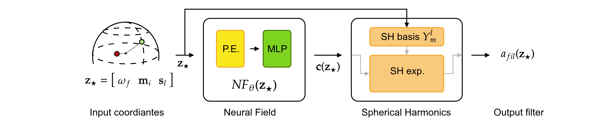

# ShaMaNS: Sound Source Localization with Spatial Measure and Neural Steerer

This repository contains the code and the supplementary materials for the paper "ShaMaNS: Sound Source Localization with Spatial Measure and Neural Steerer".

# Additional materials

The supplementary materials include the the steering vector models, 
information about the network architecture,
and the code to reproduce the results in the paper

# Dataset

The following datasets are used in the paper:
- for speech data: TIMIT dataset;
- pyroomacoustics was used to generate the spatial (with directivity) room impulse responses (RIRs) for the experiments;
- SPEAR challenge data for the ATFs and ATF interpolation models, avalilable [here](https://drive.google.com/drive/folders/1Op9KCV5bqh2CyjYByy3eVpyIkRy_EaDs?usp=sharing).

# Network architecture

The model is a neural network that takes as input the frequency, the microphone position, and the source position, and outputs the steering vector for the given frequency, and positions of microphone and source.

The network architecture is shown in the figure below. 
The network takes as input the frequency, the microphone position, and the source position. The output are the SH expansion coefficients for the given input, that is for a input batch of $B \times 3, its output is in $B \times (L+1)^2$, with $L$ being the SH order.



Network configuration:
- Positional encoding (P.E.):
  - Random Fourier Featurens
  - $F = 128$ dimensions
  - gains per coordiate $\mathbf{g} = [g_f, \mathbf{g}_{\mathbf{m}},\mathbf{g}_{\mathbf{s}}] = [\mathbf{g}_f, g_{\mathbf{m}_x},g_{\mathbf{m}_y},g_{\mathbf{m}_z},g_{\mathbf{s}_x},g_{\mathbf{s}_y},g_{\mathbf{s}_z}] = [100, 1, 1, 1, 10, 10, 10]$
- MLP: 
  - 3 hidden layers
  - 128 hidden units
  - Tanh activation function
- Spherical harmonics expansions
  - Order = 10
  - Complex spherical harmonics computed with [`sphericart` library](https://sphericart.readthedocs.io/en/latest/).

        

# Reproducing the results in the paper

To reproduce the results in the paper, please follow these steps:

## Set up the environment

1. Install dependencies
```bash
pip install -r requirements.txt
```

2. Download the models for [this Drive folder](https://drive.google.com/drive/folders/1TNzmW4RWqV4RMq-mVSH2hSedDv3HOtsU?usp=drive_link) and put them in the `data/models/` folder

## Run the experiments

1. Experiment 1: one source, varying noise type and SNR level
    ```bash
    python main.py --exp-id 1
    ```
2. Experiment 2: two sources, SNR = 20 dB (not used in the paper)
    ```bash
    python main.py --exp-id 2
    ```
3. Experiment 3: SNR  = 20 dB, varying number of sources in [1, ..., 6] and RT60 in [0, 0.123, 0.273]
    ```bash
    python main.py --exp-id 3
    ```
4. Re-used data from experiment 3 to compute localization accuracy
5. Experiment 5: study localization accuracy for different $\alpha$ parameters and for different $\alpha$ of the mixture.
    ```bash
    python main.py --exp-id 5
    ```